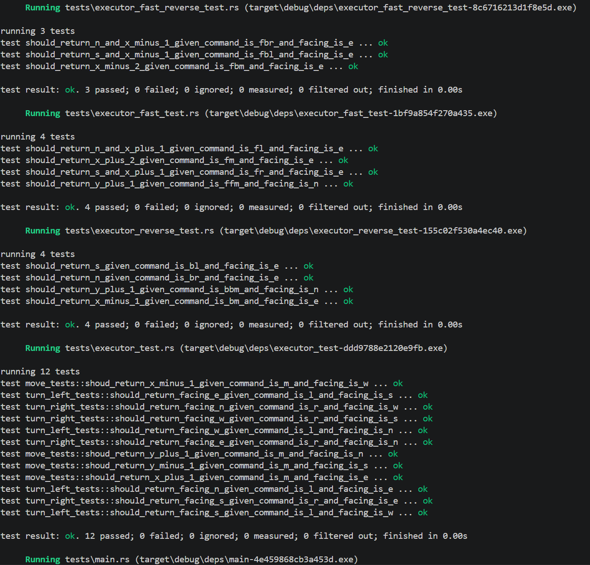
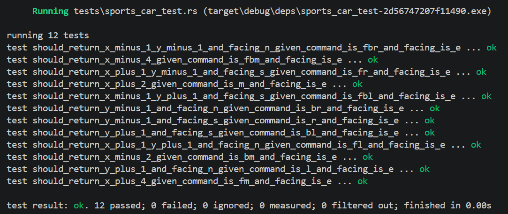
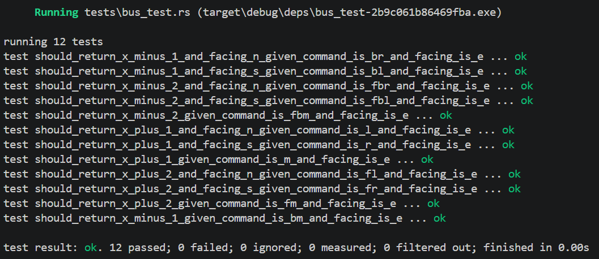

[](https://classroom.github.com/a/laCC5QXZ)

# 实验三：支持不同车辆类型的车辆自动驾驶执行器设计

| 实践日期：2026-6-10 | 实践课程：Rust 编程语言 |
| --- | --- |
| 学号：10235101495 | 姓名：李贤达 |

本实验在实验二普通车辆 `Executor` 的基础上继续进行扩展。实验二已经支持基础指令 `M/L/R`、倒车状态 `B`、加速状态 `F` 以及 `B/F` 叠加状态。实验三进一步加入跑车 `SportsCarExecutor` 和巴士 `BusExecutor` 两种车辆类型。

本项目的核心思想是：不同车辆对 `M/L/R` 的编排规则不同，但最终执行的原子动作仍然相同。因此，本项目采用三层结构组织代码：接口层负责提供统一的车辆执行入口，指令编排层负责根据不同车辆状态将命令转换为动作序列，原子操作层负责完成坐标和朝向的实际更新。

## 1. 实验目标

1. 支持普通车功能：

   | 状态 | `M` | `L` | `R` |
   | --- | --- | --- | --- |
   | 普通 | 前进 1 格 | 左转 90 度 | 右转 90 度 |
   | 倒车（输入"B"指令后） | 后退 1 格 | 右转 90 度 | 左转 90 度 |
   | 加速（输入"F"指令后） | 前进 2 格 | 前进 1 格，再左转 90 度 | 前进 1 格，再右转 90 度 |
   | 倒车加速（输入"BF/FB"指令后） | 后退 2 格 | 后退 1 格，再右转 90 度 | 后退 1 格，再左转 90 度 |

2. 支持跑车功能：

   | 状态 | `M` | `L` | `R` |
   | --- | --- | --- | --- |
   | 普通 | 前进 2 格 | 左转 90 度，再前进 1 格 | 右转 90 度，再前进 1 格 |
   | 倒车（输入"B"指令后） | 后退 2 格 | 右转 90 度，再后退 1 格 | 左转 90 度，再后退 1 格 |
   | 加速（输入"F"指令后） | 前进 4 格 | 前进 1 格，再左转 90 度，而后再前进 1 格 | 前进 1 格，再右转 90 度，而后再前进 1 格 |
   | 倒车加速（输入"BF/FB"指令后） | 后退 4 格 | 后退 1 格，再右转 90 度，而后再后退 1 格 | 后退 1 格，再左转 90 度，而后再后退 1 格 |

3. 支持巴士功能：

   | 状态 | `M` | `L` | `R` |
   | --- | --- | --- | --- |
   | 普通 | 前进 1 格 | 前进 1 格，再左转 90 度 | 前进 1 格，再右转 90 度 |
   | 倒车（输入"B"指令后） | 后退 1 格 | 后退 1 格，再右转 90 度 | 后退 1 格，再左转 90 度 |
   | 加速（输入"F"指令后） | 前进 1 格，再前进 1 格 | 前进 1 格，再前进 1 格，而后左转 90 度 | 前进 1 格，再前进 1 格，而后右转 90 度 |
   | 倒车加速（输入"BF/FB"指令后） | 后退 1 格，再后退 1 格 | 后退 1 格，再后退 1 格，而后右转 90 度 | 后退 1 格，再后退 1 格，而后左转 90 度 |
4. 使用 Assembler trait 统一抽象不同车辆的指令编排逻辑。
5. 使用 `Box<dyn Assembler>` 让同一个 `Executor` 可以在运行时持有不同车辆的状态实现。
6. 按照接口层、指令编排层、原子操作层整理目录结构，减少重复代码。

## 2. 项目结构

```text
third_program/
├── Cargo.toml
├── Cargo.lock
├── README.md
├── 实验3-类型抽象与代码组织.pptx
└── executor/
    ├── Cargo.toml
    ├── src/
    │   ├── main.rs                     # 命令行入口，选择车辆类型并执行指令
    │   ├── lib.rs                      # crate 模块声明与对外导出
    │   ├── action/                     # 原子操作层
    │   │   ├── mod.rs
    │   │   ├── action.rs               # 原子动作定义与执行
    │   │   └── pose.rs                 # 车辆坐标与朝向
    │   ├── assembler/                  # 指令编排层
    │   │   ├── mod.rs
    │   │   ├── assembler.rs            # Assembler trait 抽象接口
    │   │   ├── state.rs                # 普通车状态与指令编排
    │   │   ├── sports_car_state.rs     # 跑车状态与指令编排
    │   │   └── bus_state.rs            # 巴士状态与指令编排
    │   └── executor/                   # 接口层
    │       ├── mod.rs
    │       ├── executor.rs             # 通用执行器
    │       ├── sports_car_executor.rs  # 跑车对外入口
    │       └── bus_executor.rs         # 巴士对外入口
    └── tests/
        ├── executor_test.rs              # 普通车基础 M/L/R 测试
        ├── executor_reverse_test.rs      # 普通车 B 倒车测试
        ├── executor_fast_test.rs         # 普通车 F 加速测试
        ├── executor_fast_reverse_test.rs # 普通车 B/F 叠加测试
        ├── sports_car_test.rs            # 跑车 12 个组合测试
        ├── bus_test.rs                   # 巴士 12 个组合测试
        └── main.rs                       # 加载测试子模块
```

## 3. 模块设计

### 3.1 原子操作层 action

原子操作层包含 `Pose` 和 `Action`。

`Pose` 描述车辆当前位置和朝向：

```rust
pub struct Pose {
    pub x: i32,
    pub y: i32,
    pub heading: char,
}
```

其中：

- `x` 表示东西方向坐标，向东为正，向西为负
- `y` 表示南北方向坐标，向北为正，向南为负
- `heading` 表示朝向，取值为 `E/S/W/N`

`Pose` 只负责最基础的坐标和朝向变化：

- `forward(offset)`：按照当前朝向移动，正数表示前进，负数表示后退
- `turn_left()`：左转 90 度
- `turn_right()`：右转 90 度

`Action` 是所有复杂指令最终拆出来的最小动作：

```rust
enum Action {
    Forward(i32),
    TurnLeft,
    TurnRight,
}
```

例如：

| 车辆和命令 | 拆分后的 Action 序列 |
| --- | --- |
| 普通车 `FM` | `Forward(1), Forward(1)` |
| 普通车 `FBL` | `Forward(-1), TurnRight` |
| 跑车 `L` | `TurnLeft, Forward(1)` |
| 跑车 `FL` | `Forward(1), TurnLeft, Forward(1)` |
| 巴士 `L` | `Forward(1), TurnLeft` |
| 巴士 `FBL` | `Forward(-1), Forward(-1), TurnRight` |

这样设计后，所有车辆最终都复用同一套 `Pose` 和 `Action`，不会在每个车辆中重复出现坐标变化逻辑。

### 3.2 指令编排层 assembler

指令编排层负责把 `M/L/R` 转换成 `Vec<Action>`。

本实验相较于实验二新增了 `Assembler` trait：

```rust
pub(crate) trait Assembler {
    fn assemble(&self, cmd: char) -> Vec<Action>;
    fn move_assemble(&self) -> Vec<Action>;
    fn turn_left_assemble(&self) -> Vec<Action>;
    fn turn_right_assemble(&self) -> Vec<Action>;
    fn be_reverse(&mut self);
    fn be_fast(&mut self);
}
```

其中：

- `assemble(cmd)` 是统一分发入口
- `move_assemble()` 编排 `M`
- `turn_left_assemble()` 编排 `L`
- `turn_right_assemble()` 编排 `R`
- `be_reverse()` 切换倒车状态
- `be_fast()` 切换加速状态

不同车辆使用不同的状态结构体实现该 trait：

| 状态结构体 | 对应车辆 | 主要差异 |
| --- | --- | --- |
| `State` | 普通车 | 实现基础运动相关规则 |
| `SportsCarState` | 跑车 | 实现移动更快，转向后继续移动相关规则 |
| `BusState` | 巴士 | 转向前需要先移动相关规则 |

这样设计是因为不同车辆执行 M/L/R 时的动作组合不同，但本质上都是把一条控制命令转换成一组原子动作。因此，通过 Assembler trait 统一定义指令编排接口，可以让普通车、跑车和巴士分别实现自己的编排规则。后续如果继续新增车辆类型，只需要新增对应的 State 实现即可，而无需再修改 Executor::execute 的主流程。

### 3.3 接口层 executor

接口层负责对外提供稳定入口：

- `Executor`：普通车入口（通用执行流程）
- `SportsCarExecutor`：跑车入口
- `BusExecutor`：巴士入口

普通车直接创建 `State`：

```rust
Self::with_state(pose, Box::new(State::default()))
```

跑车和巴士复用普通车的 `Executor`：

```rust
Executor::with_state(pose, Box::new(SportsCarState::default()))
Executor::with_state(pose, Box::new(BusState::default()))
```

因此，SportsCarExecutor 和 BusExecutor 只负责创建带有对应状态的执行器，具体的指令执行逻辑仍由通用的 Executor 统一复用。

## 4. Box<dyn Assembler> 的作用

在 `Executor` 中，状态字段定义为：

```rust
state: Box<dyn Assembler>
```

其中，`dyn Assembler` 表示 trait object，也就是“某个实现了 `Assembler` trait 的具体类型”。在本项目中，它既可以指向普通车的 `State`，也可以指向跑车的 `SportsCarState`，还可以指向巴士的 `BusState`。

由于这些具体类型的大小并不完全相同，编译器无法直接把 `dyn Assembler` 作为普通字段存入 `Executor`。因此这里使用 `Box<dyn Assembler>`，把具体的状态对象放在堆上，而 `Executor` 内部只保存一个固定大小的指针。

这样设计后，`Executor` 不需要关心当前保存的是哪一种车辆状态，只需要通过 `Assembler` 接口调用统一的方法即可：

1. `Executor` 可以统一调用 `self.state.assemble(cmd)` 生成动作序列。
2. 普通车、跑车和巴士可以复用同一套 `execute()` 和 `query()` 流程。
3. 新增车辆类型时，只需要新增一个实现 `Assembler` 的 State 类型，而不需要修改已有的执行主流程。
4. 创建执行器时，通过 `Executor::with_state()` 注入对应状态即可。

```rust
match vehicle_type {
    Normal => ...
    SportsCar => ...
    Bus => ...
}
```

## 5. 执行流程

以跑车执行 `FBL` 为例：

1. `Executor::execute` 读取 `F`
2. 调用 `state.be_fast()`，进入加速状态
3. 读取 `B`
4. 调用 `state.be_reverse()`，进入倒车加速状态
5. 读取 `L`
6. 调用 `state.assemble('L')`
7. 当前 state 是 `SportsCarState`，因此执行跑车自己的 `turn_left_assemble()`
8. 生成动作序列：`Forward(-1), TurnRight, Forward(-1)`
9. `Executor::perform()` 依次执行每个 `Action`
10. `Action::perform()` 调用 `Pose` 修改坐标和朝向

## 6. 降低圈复杂度的方法设计

如果把普通车、跑车和巴士的所有规则都写进 `Executor::execute()`，代码会变成多层判断：

- 判断车辆类型
- 判断是否倒车
- 判断是否加速
- 判断当前命令是 `M/L/R`
- 判断当前朝向

这种写法会让 `execute()` 的圈复杂度快速增加，也会让新增车辆变得困难。

本项目的处理方式是把复杂逻辑拆开：

1. `Executor::execute` 只负责命令分发：

```rust
match cmd {
    'B' => self.state.be_reverse(),
    'F' => self.state.be_fast(),
    _ => self.perform(self.state.assemble(cmd)),
}
```

2. `Assembler::assemble` 只负责把 `M/L/R` 分发给对应编排方法：

```rust
match cmd {
    'M' => self.move_assemble(),
    'L' => self.turn_left_assemble(),
    'R' => self.turn_right_assemble(),
    _ => Vec::new(),
}
```

3. 各个 State 只负责本车辆自己的编排规则。
4. `Action` 只负责分发最小动作。
5. `Pose` 只负责坐标和朝向变化。

这样每个函数只处理一层决策，避免了在一个函数里出现大量嵌套的分支语句。

## 7. 测试设计

测试按照车辆类型和状态组合进行拆分。

| 测试文件 | 覆盖内容 |
| --- | --- |
| `executor_test.rs` | 普通车基础 `M/L/R` 在四个方向下的行为 |
| `executor_reverse_test.rs` | 普通车 `B` 倒车状态下的 `M/L/R`，以及 `BB` 取消状态 |
| `executor_fast_test.rs` | 普通车 `F` 加速状态下的 `M/L/R`，以及 `FF` 取消状态 |
| `executor_fast_reverse_test.rs` | 普通车 `B/F` 叠加状态下的 `M/L/R` |
| `sports_car_test.rs` | 跑车在 Normal、B、F、B/F 状态下执行 `M/L/R` 的 12 个测试 |
| `bus_test.rs` | 巴士在 Normal、B、F、B/F 状态下执行 `M/L/R` 的 12 个测试 |
| `main.rs` | 加载测试子模块，满足补充要求 |

普通车测试覆盖：

| 指令 | Normal | B | F | BF |
| --- | --- | --- | --- | --- |
| `M` | 前进 1 格 | 后退 1 格 | 前进 2 格 | 后退 2 格 |
| `L` | 左转 90 度 | 右转 90 度 | 前进 1 格后左转 | 后退 1 格后右转 |
| `R` | 右转 90 度 | 左转 90 度 | 前进 1 格后右转 | 后退 1 格后左转 |

普通车补充测试：

| 测试内容 | 期望结果 |
| --- | --- |
| 朝东执行 `M` | x + 1，朝向 E |
| 朝南执行 `M` | y - 1，朝向 S |
| 朝西执行 `M` | x - 1，朝向 W |
| 朝北执行 `M` | y + 1，朝向 N |
| 朝东执行 `L` | 朝向 N |
| 朝南执行 `L` | 朝向 E |
| 朝西执行 `L` | 朝向 S |
| 朝北执行 `L` | 朝向 W |
| 朝东执行 `R` | 朝向 S |
| 朝南执行 `R` | 朝向 W |
| 朝西执行 `R` | 朝向 N |
| 朝北执行 `R` | 朝向 E |
| 朝北执行 `BBM` | 取消倒车后 y + 1，朝向 N |
| 朝北执行 `FFM` | 取消加速后 y + 1，朝向 N |

跑车测试覆盖（共12个测试用例）：

| 指令 | Normal | B | F | BF |
| --- | --- | --- | --- | --- |
| `M` | 前进 2 格 | 后退 2 格 | 前进 4 格 | 后退 4 格 |
| `L` | 左转后前进 | 右转后后退 | 前进、左转、前进 | 后退、右转、后退 |
| `R` | 右转后前进 | 左转后后退 | 前进、右转、前进 | 后退、左转、后退 |

巴士测试覆盖（共12个测试用例）：

| 指令 | Normal | B | F | BF |
| --- | --- | --- | --- | --- |
| `M` | 前进 1 格 | 后退 1 格 | 前进 2 格 | 后退 2 格 |
| `L` | 前进后左转 | 后退后右转 | 前进 2 格后左转 | 后退 2 格后右转 |
| `R` | 前进后右转 | 后退后左转 | 前进 2 格后右转 | 后退 2 格后左转 |

## 8. 运行方式

在目录下执行：

```powershell
cargo test
```

也可以执行代码质量检查：

```powershell
cargo clippy --all-targets -- -D warnings
```

运行程序`main`程序 ：

```powershell
cargo run
```

程序启动后输入车辆类型：

- `1`：普通车
- `2`：跑车
- `3`：巴士

然后输入由 `M/L/R/B/F` 组成的命令序列，输入 `Q` 退出。

## 9. 测试结果

### 普通车测试结果



### 跑车测试结果



### 巴士测试结果



## 10. 总结

本实验在实验二的基础上，引入了跑车和巴士两种新车辆类型。通过 `Assembler` trait 抽象不同车辆的指令编排逻辑，通过 `Box<dyn Assembler>` 让 `Executor` 在运行时持有不同车辆状态，并通过三层目录结构把接口层、指令编排层和原子操作层分离。

通过这样的设计，Executor::execute() 只负责统一的指令分发和动作执行，不同车辆的差异由各自的 State 实现封装，底层的 Action 和 Pose 则被所有车辆复用。因此，后续扩展新车辆时无需修改执行主流程，只需新增对应状态实现即可，从而降低了圈复杂度，减少了代码重复，并提高了扩展性。